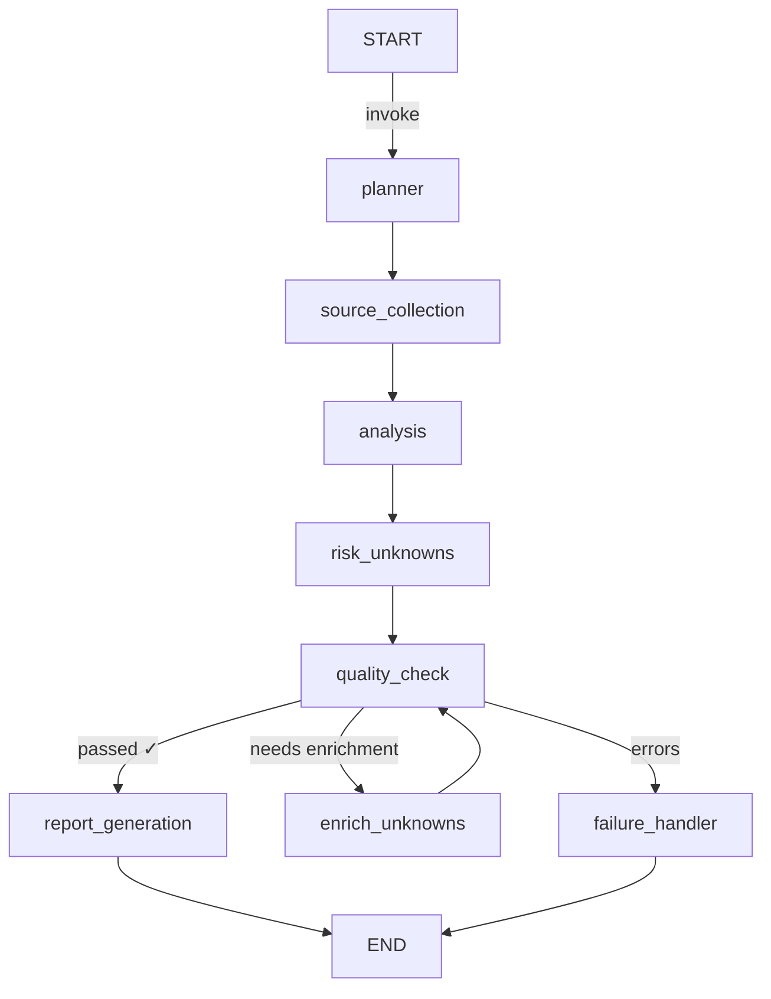

# System Architecture

## Overview

The AI Research Copilot is a full-stack web application with a React single-page application (SPA) frontend and a Python/FastAPI backend. The frontend communicates with the backend over HTTP REST APIs, with Vite's dev server proxying `/api` requests to the backend running on port 8000. Data is persisted in a local SQLite database.

```
┌──────────────┐     HTTP      ┌──────────────────┐     SQL      ┌────────┐
│  React SPA   │ ────────────> │  FastAPI Backend  │ ──────────> │ SQLite │
│  (port 5173) │ <──────────── │  (port 8000)      │ <────────── │        │
└──────────────┘               └──────────────────┘              └────────┘
```

## Backend Structure

```
backend/
  app/
    api/              # FastAPI route modules
      router.py       # Main router, /api prefix
      sessions.py     # Session CRUD endpoints
      workflow.py     # Workflow execution and report endpoints
      chat.py         # Chat message endpoints
      health.py       # Health check endpoint
    core/
      config.py       # Settings via pydantic-settings (RESEARCH_COPILOT_ prefix)
    database/
      session.py      # Engine, SessionLocal, init_db()
    models/
      enums.py        # SessionStatus, WorkflowRunStatus, WorkflowStepStatus, MessageRole
      session.py      # ResearchSession model
      workflow.py     # WorkflowRun and WorkflowStep models
      source.py       # ResearchSource model
      report.py       # ResearchReport model (1:1 with session)
      chat.py         # ChatMessage model
    schemas/
      session.py      # SessionCreate, SessionResponse, etc.
      workflow.py     # RunStartResponse, WorkflowStatusResponse, StepResponse, ReportResponse
      chat.py         # ChatMessageResponse, ChatHistoryResponse
    services/
      session.py      # SessionService (CRUD operations)
      planner.py      # PlannerService — LLM-based research plan
      source_collection.py  # SourceCollectionService — HTTP website fetcher
      analysis.py     # AnalysisService — LLM-based content analysis
      risk_unknowns.py      # RiskUnknownsService — LLM-based risk identification
      report.py       # ReportGenerationService — deterministic report builder
      chat.py         # ChatService — LLM-grounded chat
      workflow.py     # WorkflowService — orchestration, background execution
      llm.py          # LLMService — OpenAI-compatible API wrapper
    workflow/
      graph.py        # StateGraph definition, routing, compiled_graph
      state.py        # GraphState TypedDict
      nodes.py        # 8 node functions with _run_node wrapper
      persistence.py  # DB helpers for workflow steps/runs
    main.py           # FastAPI app, lifespan, logging
  tests/
    conftest.py
    test_health.py
    test_sessions.py
    test_workflow.py
    test_chat.py
```

## LangGraph Workflow

The research workflow is defined as a `StateGraph` with 8 nodes and conditional routing. Each research session triggers its own graph invocation in a background daemon thread.



### GraphState

The shared state typed as `GraphState` (a `TypedDict`) flows through all nodes:

| Field | Type | Description |
|---|---|---|
| `session_id` | `str` | UUID of the research session |
| `company_name` | `str` | Target company name |
| `website_url` | `str` | Company website URL |
| `research_objective` | `str` | User's research goal |
| `plan` | `dict` | Output of planner node |
| `source_text` | `str` | Raw text extracted from website |
| `source_metadata` | `list` | Fetch metadata (URL, status, timestamps) |
| `analysis_output` | `dict` | Structured analysis (overview, products, customers, signals) |
| `risks_and_unknowns` | `dict` | Risks, unknowns, unsupported claims, confidence notes |
| `quality_result` | `dict` | Pass/fail, research_quality_score (0–100), confidence, source length, missing sections, enrich retries |
| `final_report` | `dict` | Complete 9-section report |
| `warnings` | `list[str]` | Accumulated non-fatal warnings |
| `errors` | `list[str]` | Accumulated error messages |
| `workflow_status` | `str` | Current status (running, completed, failed) |

### Node Walkthrough

1. **planner** — Calls `PlannerService.generate_plan()` via LLM to produce a research plan with focus areas, key questions, and business hypotheses. Writes to `state["plan"]`.

2. **source_collection** — Calls `SourceCollectionService.collect()` which uses `httpx` to fetch the company website and strip HTML tags. On failure, returns empty `source_text` with a warning rather than crashing. Writes to `state["source_text"]` and `state["source_metadata"]`.

3. **analysis** — Calls `AnalysisService.analyze()` via LLM to extract company overview, products/services, target customers, and business signals. If `source_text` is empty, returns defaults with no LLM call (anti-hallucination). Writes to `state["analysis_output"]`.

4. **risk_unknowns** — Calls `RiskUnknownsService.identify()` via LLM to identify risks, unknowns, unsupported claims, and confidence notes. Same empty-source bypass as analysis. Writes to `state["risks_and_unknowns"]`.

5. **quality_check** — Rule-based (no LLM). Checks: source text length ≥ 500, all 4 analysis sections non-empty, unknowns non-empty. Computes a deterministic `research_quality_score` (0–100) from source coverage, section completeness, and unknown count, plus a `confidence` label (low/medium/high). Returns `passed`, `research_quality_score`, `confidence`, `source_length`, `missing_sections`, and `enrich_retries` counter. Writes to `state["quality_result"]`.

6. **enrich_unknowns** — Deterministic gap analysis (no LLM). Reads `quality_result.missing_sections` and generates structured gap entries (`research_gap`, `why_missing`, `recommended_source`, `confidence`) for each missing section. Increments `enrich_retries`. Only runs if quality check failed and retries remain. Writes enriched items to `state["risks_and_unknowns"]["enriched_items"]`.

7. **report_generation** — Calls `ReportGenerationService` (deterministic, no LLM). Builds all 9 report sections from accumulated state. Persists via `persist_report()`. Writes to `state["final_report"]`.

8. **failure_handler** — Sets `workflow_status` to `"failed"` and returns accumulated errors. Always reaches END without raising.

### Conditional Routing

The `route_after_quality` function in `graph.py` inspects `state["quality_result"]` and `state["errors"]` to decide the next node:

- **`errors`** — Any errors in state → `failure_handler`
- **`sufficient`** — Quality passed → `report_generation`
- **`enrich`** — Quality failed and `enrich_retries < MAX_ENRICH_RETRIES` (1) → `enrich_unknowns` (loops back to quality_check)

## Failure Handling

Every node executes through the `_run_node` wrapper in `nodes.py`:

1. Opens a DB session via `get_db()`
2. Resolves the active `WorkflowRun`
3. Transitions run from `pending` → `running`
4. Creates a `WorkflowStep` record with input state
5. Calls the node's `work_fn(state)`
6. On success: marks step as `completed` with output
7. On exception: marks step as `failed` with error message, marks run as `failed`, appends error to `state["errors"]`

The background worker in `WorkflowService._execute_workflow()` creates its own DB session, invokes `compiled_graph.invoke()`, and sets session status to `completed` or `failed`.

## Recoverability

- **Enrichment loop**: Up to 1 retry when quality check fails. `enrich_unknowns` generates per-section gap entries for all missing analysis sections using deterministic templates. After enrichment, the workflow runs quality_check again. If still insufficient, it proceeds to report generation with available data.
- **Quality scoring**: Each quality_check run computes a `research_quality_score` (0–100) and `confidence` label from source coverage, section completeness, and unknown count. The score is exposed in the API response and UI.
- **Empty source bypass**: If website fetching fails, `source_text` is empty, and downstream LLM nodes (analysis, risk_unknowns) skip their LLM calls and return defaults. The quality check will flag missing sections but the workflow completes.
- **Graceful degradation**: Missing or broken data propagates as warnings, not crashes. The report always produces output with "Information not available" for missing sections.
- **Daemon thread isolation**: Background threads use their own DB sessions. An exception in one session's workflow does not affect others.

## Persistence Model

```
ResearchSession 1───* WorkflowRun 1───* WorkflowStep
ResearchSession 1───* ResearchSource
ResearchSession 1───1 ResearchReport (1:1)
ResearchSession 1───* ChatMessage
```

All IDs are UUIDs. Timestamps are managed automatically via SQLAlchemy's `default` and `onupdate`.

## API Endpoints

| Method | Path | Description |
|---|---|---|
| GET | `/api/health` | Health check |
| POST | `/api/sessions` | Create research session |
| GET | `/api/sessions` | List all sessions |
| GET | `/api/sessions/{id}` | Get session detail |
| POST | `/api/sessions/{id}/run` | Start workflow execution |
| GET | `/api/sessions/{id}/workflow` | Get workflow status + steps |
| GET | `/api/sessions/{id}/report` | Get structured report |
| GET | `/api/sessions/{id}/chat` | Get chat history |
| POST | `/api/sessions/{id}/chat` | Send chat message |

All POST endpoints return 201. Missing sessions return 404. Invalid state transitions return 409. Missing AI configuration returns 503.
